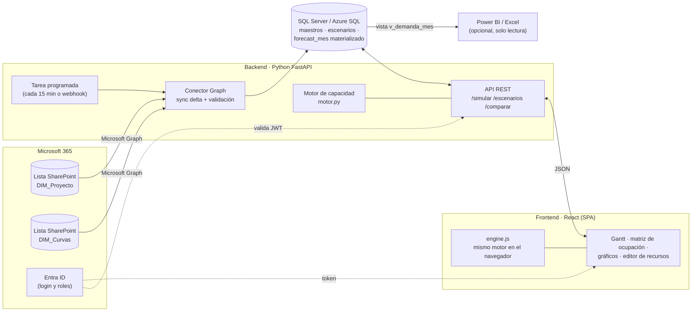
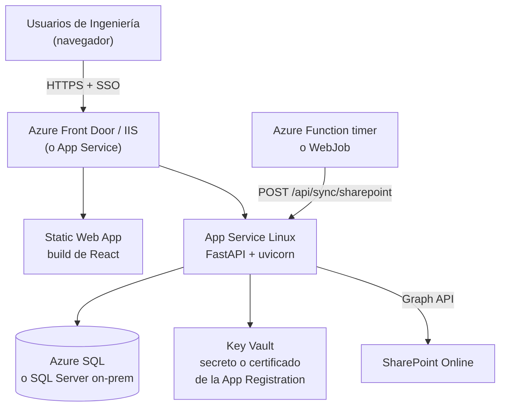
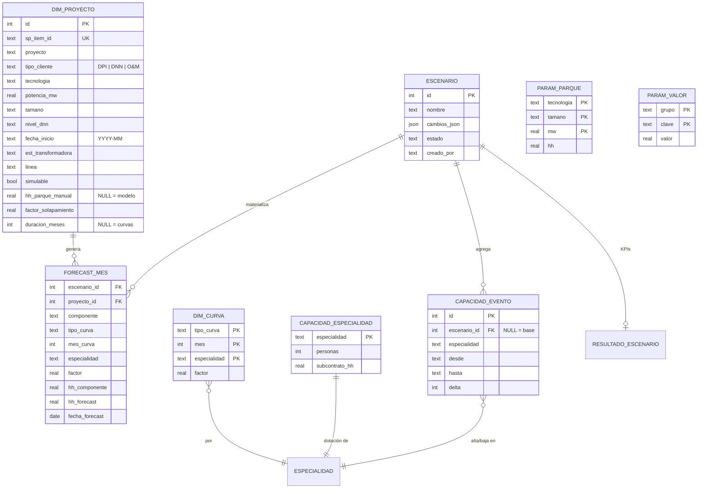
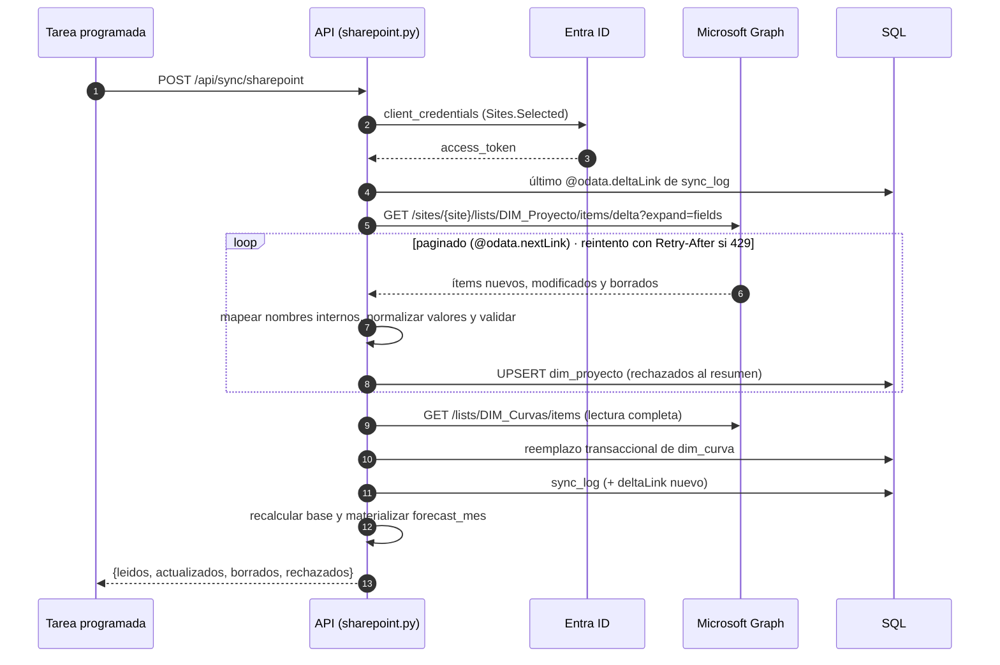
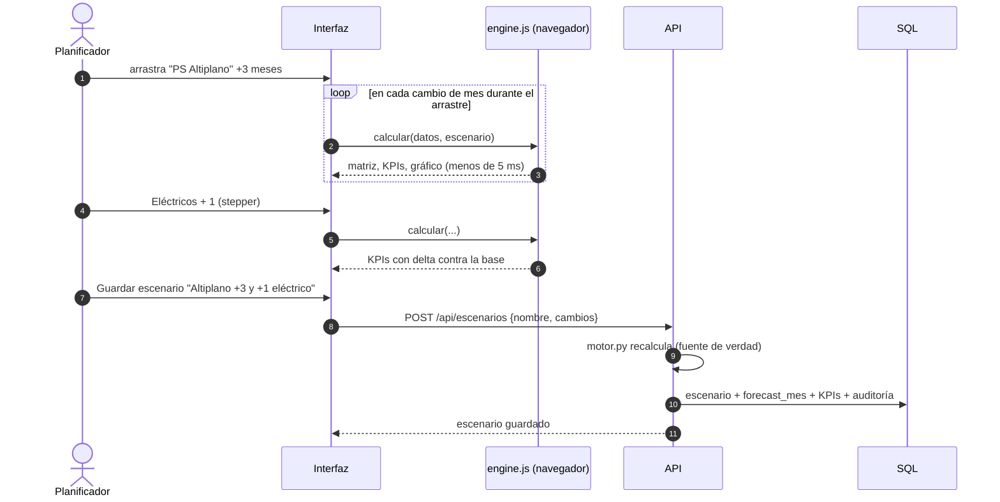
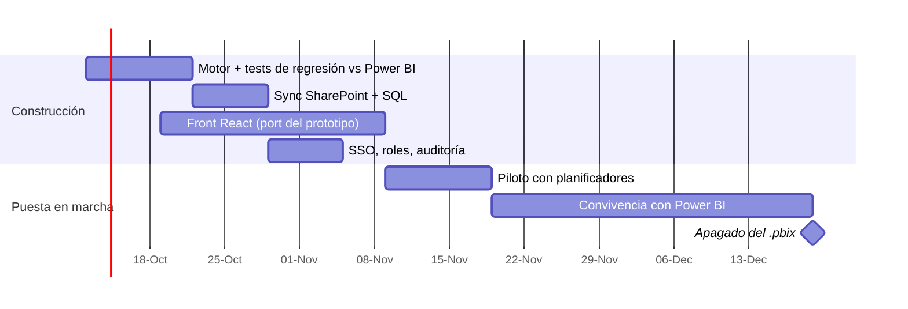

# Migración del Dashboard de Capacidad de Ingeniería: de Power BI a aplicación web con simulación

**Propuesta técnica · versión 1 · octubre 2026**

> Este repositorio incluye un prototipo funcional (`prototipo/`), el motor de cálculo en Python y
> JavaScript (`backend/app/motor.py`, `prototipo/engine.js`), una API REST (`backend/app/main.py`), el
> modelo de datos (`db/schema.sql`) y el conector SharePoint (`backend/app/sharepoint.py`). Los
> números que aparecen en este documento salen de **datos de ejemplo**, no de la lista real.

---

## 0. Resumen ejecutivo

| Pregunta | Respuesta corta |
|---|---|
| ¿Es viable? | **Sí.** El modelo es determinista y chico (decenas de proyectos × 11 curvas × 5 especialidades × 24–36 meses ≈ 10⁴ filas). Se recalcula entero en **< 5 ms** en el navegador. |
| ¿Qué gana el área? | Simulación **en vivo**: arrastrar un proyecto, sumar un eléctrico o cambiar un factor de solapamiento recalcula la matriz, los KPIs y el gráfico al instante. Escenarios guardados y comparables. Detalle "qué proyectos explican esta celda". Búsqueda del **mejor mes de inicio** y de la **dotación mínima**. Nada de esto es práctico en Power BI. |
| ¿Reemplaza a Power BI? | **Sí para este caso de uso**, que es un simulador de planificación (escritura + what-if) y no un reporte de solo lectura. Recomendación: convivencia de 1–2 meses, con la app como herramienta de planificación y Power BI leyendo los resultados materializados, y después apagar el `.pbix`. |
| Stack recomendado | **React + TypeScript** (front) · **Python FastAPI** (API y motor) · **SQL Server** (o Azure SQL; SQLite en desarrollo) · **Microsoft Graph** para SharePoint · **Entra ID** para login. |
| Esfuerzo | MVP productivo en **6–8 semanas** con 1 full-stack + 0,3 BI/negocio. |
| Riesgo principal | La lógica hoy vive en Power Query/DAX sin especificación escrita. Se mitiga con tests de regresión contra los números actuales (`máx 1,43`, `oct-26`, `2.960 HH`) antes de apagar Power BI. |

---

## 1. Arquitectura recomendada

### 1.1 Vista lógica



**Decisión clave: el motor corre en dos lugares.**

- **En el navegador** (`engine.js`) para la interacción: cada arrastre, cada `+1 persona` recalcula sin
  ida y vuelta al servidor. Es lo que hace que la simulación se sienta instantánea.
- **En el servidor** (`motor.py`) como fuente de verdad: al guardar un escenario, la API lo recalcula,
  materializa `forecast_mes` y guarda los KPIs. Reportes, comparaciones y exportaciones salen de ahí.

Un test de paridad (`backend/tests/test_motor.py::ParidadJavaScript`) corre ambos motores sobre los
mismos datos y escenarios y exige el mismo resultado a 9 decimales. Si alguien cambia una regla en un
lado y no en el otro, el CI falla.

### 1.2 Vista de despliegue



Alternativa on-premise equivalente: IIS sirviendo el build estático + servicio Windows con uvicorn, SQL
Server corporativo y una tarea programada de Windows para la sincronización. El código no cambia.

### 1.3 Por qué este stack

| Opción evaluada | Veredicto |
|---|---|
| HTML + JS vanilla | Suficiente para el prototipo (es lo que hay en `prototipo/`). Para producción conviene React por mantenibilidad, componentes y tipado. |
| **React + TypeScript** | ✔ Ecosistema maduro para grillas, Gantt y gráficos; MSAL React para el SSO con Entra ID. |
| Node.js como backend | Viable; permitiría un único motor en JS/TS. Se descarta como primera opción porque el área de BI trabaja en Python y Python facilita análisis, pruebas con pandas y una futura optimización (PuLP/OR-Tools). |
| **Python FastAPI** | ✔ Motor legible por gente de BI, validación con Pydantic, OpenAPI automático. |
| SQLite | ✔ Desarrollo y demo (cero instalación). No para multiusuario concurrente. |
| **SQL Server / Azure SQL** | ✔ Producción: backups, seguridad corporativa, y Power BI/Excel lo consumen nativo. |
| **SharePoint vía Microsoft Graph** | ✔ API soportada, con delta queries, sin depender de la API REST clásica `_api/web`. |

---

## 2. Modelo de datos

DDL completo en [`db/schema.sql`](../db/schema.sql).



**Criterios de diseño**

1. **Las reglas de estimación pasan a ser datos, no fórmulas.** Las tablas de interpolación de HH Parque
   (`param_parque`), las HH por tamaño de ET y Línea y los factores (30 % ampliación, 70 % MT, factores DNN
   y O&M) viven en `param_*`. Cambiar "Solar Muy Grande 500 MW = 10.000 HH" es editar una fila, no un DAX.
2. **Un escenario guarda solo diferencias** (`cambios_json`) respecto de la base. La base se puede
   re-sincronizar desde SharePoint cada 15 minutos sin romper los escenarios: un escenario "mover PS
   Altiplano +4 meses" sigue siendo válido aunque cambie la potencia en SharePoint.
3. **Override manual explícito.** Las columnas `HH Estimadas *` de SharePoint, si vienen cargadas, se
   respetan como valor manual (`hh_*_manual`). Si vienen vacías, calcula el modelo. Así el planner puede
   pisar una estimación sin tocar el modelo.
4. **`forecast_mes` es la tabla `Forecast_Mes_V4` materializada**, con las mismas columnas. Sirve para
   auditar, exportar y que Power BI o Excel sigan leyendo si hace falta.

---

## 3. Backend

Código en [`backend/app/`](../backend/app).

| Módulo | Responsabilidad |
|---|---|
| `motor.py` | Motor puro, sin dependencias: componentes, forecast, capacidad, KPIs, pareto, mejor inicio. |
| `repositorio.py` | SQL ↔ diccionario del motor. Escenarios, auditoría, materialización. |
| `sharepoint.py` | Cliente Graph (MSAL client credentials), sync delta, mapeo y validación de columnas. |
| `main.py` | API FastAPI. También sirve el prototipo en `/`. |
| `datos_ejemplo.py` | Dataset ilustrativo: 15 proyectos, 11 curvas, 5 especialidades. |

### 3.1 Endpoints

| Método | Ruta | Uso |
|---|---|---|
| GET | `/api/datos` | Dataset completo para el front (proyectos, curvas, parámetros, capacidad). |
| GET | `/api/proyectos` | Proyectos con sus componentes calculados (≙ `Forecast_Componentes`). |
| POST | `/api/simular` | `{cambios}` → KPIs, matriz, pareto. No guarda nada. |
| GET | `/api/detalle?mes=&especialidad=` | Proyectos y componentes que explican una celda. |
| GET | `/api/proyectos/{id}/mejor-inicio` | Barre desplazamientos de −3 a +12 meses y elige el que minimiza las HH excedidas. |
| GET/POST/PUT | `/api/escenarios[/{id}]` | Alta, modificación y lista de escenarios (con auditoría). |
| GET | `/api/escenarios/{id}/resultado` | Resultado completo de un escenario. |
| GET | `/api/comparar?ids=0,3,5` | KPIs y cuellos de botella lado a lado (0 = base). |
| POST | `/api/sync/sharepoint` | Dispara la sincronización (también la llama la tarea programada). |

OpenAPI automático en `/docs`.

### 3.2 Forma de un escenario

```json
{
  "proyectos": {
    "8":  { "desplazamiento": 4 },
    "3":  { "incluir": false },
    "2":  { "factorSolapamiento": 0.8, "potencia": 220 },
    "5":  { "duracion": 6 }
  },
  "capacidad": {
    "dotacion":      { "Eléctricos": 16 },
    "subcontratoHH": { "Civiles": 200 },
    "eficiencia":    0.80,
    "eventos": [
      { "especialidad": "Eléctricos", "desde": "2027-03", "hasta": null, "delta": 2, "nota": "Ingreso licitado" }
    ]
  }
}
```

### 3.3 Seguridad

- **Login:** SSO con Entra ID (MSAL React en el front, validación del JWT en FastAPI).
- **Roles** (grupos de Entra ID): `Lector` (ve el escenario publicado), `Planificador` (crea y edita
  escenarios), `Administrador` (edita parámetros y curvas, publica la base).
- **SharePoint:** App Registration con permiso **`Sites.Selected`**, concedido solo al sitio de
  Ingeniería. El secreto o certificado vive en Key Vault, nunca en el front.
- **Auditoría:** cada alta o cambio de escenario queda en `auditoria` con usuario y JSON de cambios.

---

## 4. Frontend

El prototipo (`prototipo/index.html`) ya implementa la interfaz completa en JS vanilla, con el mismo
espíritu que la herramienta de cronogramas de directorio que usa el área: barra de herramientas
compacta, línea de tiempo mensual tipo Excel, barras arrastrables, editor lateral, diálogos movibles,
escenarios, exportación, reporte PDF, atajos de teclado, deshacer y tema claro/oscuro. Para producción
se porta a React + TypeScript manteniendo esa estructura:

```
src/
  motor/            engine.ts (port tipado de engine.js; mismos tests de paridad)
  api/              cliente REST generado desde OpenAPI
  estado/           store (Zustand) — dataset, escenario abierto, selección, undo/redo
  componentes/
    BarraHerramientas.tsx
    FranjaKPI.tsx
    LineaDeTiempo/  Cabecera.tsx · FilaProyecto.tsx · BarraProyecto.tsx (drag)
    Ocupacion/      MatrizOcupacion.tsx · FilaEspecialidad.tsx (stepper de personas)
    Graficos/       DemandaVsCapacidad.tsx · Pareto.tsx · Mix.tsx
    Editor/         EditorProyecto.tsx · EditorEspecialidad.tsx · DetalleCelda.tsx · Resumen.tsx
    Dialogos/       Recursos.tsx · Escenarios.tsx · Comparar.tsx · Exportar.tsx
```

Librerías sugeridas: **Zustand** (estado + undo), **TanStack Query** (cache de la API), **visx o
Recharts** (gráficos), **@dnd-kit** o pointer events nativos (arrastre), **jsPDF** (reporte).

---

## 5. Cómo consumir SharePoint



Puntos prácticos:

- **Nombres internos.** SharePoint expone las columnas por su nombre interno (`HH Estimadas Parque` →
  `HH_x0020_Estimadas_x0020_Parque`). El mapeo está centralizado en `MAPEO_PROYECTO`. Se obtiene con
  `GET /sites/{site}/lists/DIM_Proyecto/columns`.
- **Delta queries.** Desde la segunda corrida solo viajan los cambios, y las bajas llegan como
  `deleted`. Una lista de cientos de ítems sincroniza en 1–2 segundos.
- **Validación.** Un ítem con `Tipo Cliente` desconocido, sin fecha o con solapamiento fuera de [0,1]
  no rompe la carga: queda en `rechazados` y se muestra en la interfaz.
- **Tiempo real opcional.** Graph permite **webhooks** (`/subscriptions` sobre la lista) para disparar
  la sincronización al instante en vez de cada 15 minutos.
- **Escritura de vuelta (opcional).** Si se decide que la fecha simulada de un proyecto se adopte como
  oficial, la API puede hacer `PATCH /items/{id}/fields` sobre `Fecha Inicio`. Recomiendo que sea una
  acción explícita de "Publicar" y que la haga solo un Administrador.

---

## 6. Cómo reemplazar las tablas calculadas de Power BI

| Power BI hoy | Reemplazo | Dónde |
|---|---|---|
| Columnas calculadas **HH Estimadas Parque** (interpolación por potencia, tecnología, tamaño y tipo de cliente) | `interpolar()` + `hh_parque_base()` sobre `param_parque` | `motor.py` |
| **HH Estimadas ET** (Chico 500 … Muy Grande 3.000; Ampliación = 30 %) | `componentes()` con `param_valor` grupo `et` y `factorAmpliacionET` | `motor.py` |
| **HH Estimadas Línea** (300 … 1.800; MT = 70 % de AT) | `componentes()` con grupo `linea` y `factorLineaMT` | `motor.py` |
| Tabla **Forecast_Componentes** | `componentes(p)` → lista `{componente, curva, hh}` | `motor.py` / `/api/proyectos` |
| Tabla **Forecast_Mes_V4** (Componentes × DIM_Curvas; `HH Forecast = HHComponente × Factor × Factor Solapamiento`) | `forecast()`, materializado en `forecast_mes` | `motor.py` / SQL |
| Tabla de **Capacidad** | `capacidad_mes()` = personas (base + altas/bajas) × HH/persona × eficiencia + subcontrato | `motor.py` |
| Medida **Ocupación** | `demanda / capacidad` por mes y especialidad | `calcular()` |
| Medida **Máxima Ocupación** | `kpis.maxOcupacion` (valor, mes, especialidad) | `calcular()` |
| Medida **Primer Mes Crítico** | `kpis.primerMesCritico` (primer mes con ocupación > 1 y qué especialidades) | `calcular()` |
| Medida **HH Excedidas** | `Σ max(0, demanda − capacidad)` | `calcular()` |
| Visual **Pareto** | `pareto` (HH, % y % acumulado) | `calcular()` |
| % **DPI / DNN / O&M** | `mixTipoCliente` | `calcular()` |
| Impacto **ET y Líneas** | `mixComponente` (Parque / ET / Línea / DNN / O&M) | `calcular()` |
| Duración fija de cada curva (no editable en el modelo actual) | `duracion` por proyecto + `reescalar()`: la curva se estira o comprime conservando HH totales y forma | `motor.py` |
| Formato condicional (semáforo) | Clases `ok` < 0,80 · `warn` < 1,00 · `crit` ≥ 1,00 | front |

### Ejemplo verificado (PPSDV)

```
Solar · Muy Grande · 300 MW  → interpolar([[300,7000],[500,10000]], 300) = 7.000 HH  (Parque, curva Solar)
ET Nueva · Muy Grande        → 3.000 HH                                     (ET, curva ET Nueva)
Línea AT · Muy Grande        → 1.800 HH                                     (Línea, curva Línea AT)
Total                        → 11.800 HH
```

Está cubierto por `test_componentes_ppsdv_suman_11800`. En el forecast mensual suma 11.802 HH porque las
curvas de ejemplo suman "aproximadamente 1" (redondeo a 4 decimales), igual que en `DIM_Curvas`.

### Plan de validación contra Power BI

1. Exportar desde Power BI `Forecast_Mes_V4` y la matriz de ocupación del corte actual.
2. Cargar la misma `DIM_Proyecto` y `DIM_Curvas` en la app.
3. Test de regresión: diferencias por (proyecto, componente, mes, especialidad) < 0,01 HH y KPIs
   idénticos (**máx 1,43 · oct-26 · 2.960 HH**).
4. Cada diferencia es una regla no documentada del `.pbix`. Se documenta y se codifica (típicamente:
   redondeos, filtros por `Estado`, tratamiento de fechas fuera de horizonte).

---

## 7. Simulación dinámica de recursos



**Palancas disponibles** (todas en el prototipo):

| Palanca | Interfaz | Efecto en el motor |
|---|---|---|
| Mover el inicio de un proyecto | Arrastrar la barra · flechas ← → · botones ±1/±3 | `fechaInicio` |
| Cambiar la duración de un proyecto | Arrastrar el borde derecho (o el izquierdo, que también mueve el inicio) · Shift+← → · campo «Duración» · botones ±1/±3 | `duracion` (ver 7.1) |
| Incluir o excluir un proyecto | Casilla en la fila | `incluir` |
| Potencia, tamaño, tecnología, ET, línea, nivel DNN | Editor lateral | Recalcula HH por componente |
| Factor de solapamiento | Editor lateral | Multiplica HH Forecast |
| HH manual | Editor lateral | Pisa el modelo |
| Dotación por especialidad | Stepper − / + en la matriz · editor · diálogo Recursos | `dotacion` |
| Altas y bajas con fecha | Editor de especialidad | `eventos` (desde, hasta, ±personas) |
| Subcontrato | Editor de especialidad · Recursos | HH/mes extra |
| HH por persona y eficiencia | Diálogo Recursos | Capacidad global |
| Horizonte | Diálogo Recursos | Meses evaluados |

### 7.1 Duración editable

Cada curva de `DIM_Curvas` tiene una duración propia (Solar 12 meses, ET Nueva 10, Línea AT 9…), y en
Power BI esa duración no se puede tocar. En la app cada proyecto tiene un campo opcional `duracion`
(meses). Cuando está cargado:

1. El componente más largo pasa a durar exactamente `duracion` meses; los demás se escalan en la misma
   proporción (PPSDV a 6 meses: Parque 12 → 6, ET 10 → 5, Línea 9 → 5).
2. Cada curva se **reescala** tratándola como una densidad constante dentro de cada mes y repartiendo
   la acumulada sobre la nueva grilla (`reescalar()`). **Las HH totales no cambian** y la forma de la
   curva se conserva: acortar concentra la demanda (más HH por mes), alargar la diluye.
3. Vacío significa la duración de las curvas. En SharePoint puede agregarse una columna opcional
   «Duración meses» para fijarla desde la lista; si no existe, la duración se simula solo en la app.

Está cubierto por `test_reescalar_conserva_suma_y_forma`, `test_duracion_comprime_sin_perder_hh` y
por el test de paridad Python/JavaScript.

**Asistentes que Power BI no puede ofrecer:**

- **Mejor inicio:** prueba desplazamientos de −3 a +12 meses de un proyecto simulable y muestra las HH
  excedidas para cada uno; aplica el mejor con un clic.
- **Mejor duración:** prueba duraciones entre el 50 % y el 200 % de la original y muestra las HH
  excedidas de cada una; útil para decidir si conviene estirar un proyecto en lugar de sumar gente.
- **Refuerzo sugerido:** por especialidad, cuántas personas faltan en el peor mes; con un clic agrega
  el alta desde el primer mes crítico.
- **Nivelar:** dotación mínima por especialidad para que ningún mes supere 1,00.
- **Detalle de celda:** clic en cualquier celda de la matriz y aparecen los proyectos y componentes que
  la explican, con su porcentaje.

---

## 8. Cómo modificar recursos eléctricos desde la interfaz

Tres niveles, de más rápido a más detallado:

1. **Stepper en la fila "Eléctricos"** de la matriz: `−` / `+` cambia la dotación base. La fila, el
   total del área, el gráfico y los KPIs se recalculan al instante.
2. **Editor de la especialidad** (clic en el nombre "Eléctricos"):
   - personas base y **subcontrato en HH/mes**;
   - **altas y bajas programadas** con mes desde y hasta (p. ej. "+2 desde mar-27", "−1 jubilación
     desde mar-27");
   - tabla mes a mes de demanda, capacidad y ocupación; clic en un mes abre el detalle.
3. **Diálogo Recursos:** edición masiva de las cinco especialidades, HH por persona por mes, eficiencia
   y horizonte.

Cada cambio entra en la pila de deshacer (Ctrl+Z) y, al guardar el escenario, se persiste como `cambios`.

---

## 9. Cómo ejecutar escenarios

- **Guardar:** foto del estado actual con nombre ("+2 eléctricos desde mar-27").
- **Abrir:** reemplaza el estado de trabajo, y se puede deshacer.
- **Base de comparación:** cualquier escenario puede ser la base. La franja de KPIs muestra deltas en
  verde o rojo (máx. ocupación, primer mes crítico en meses, HH excedidas, HH forecast).
- **Comparar:** tabla lado a lado de todos los escenarios con máx. ocupación, dónde ocurre, primer mes
  crítico, HH excedidas, personas y pico por especialidad.
- **Exportar e importar JSON:** para compartir un escenario por correo o Teams en el prototipo. En
  producción los escenarios viven en la base y se comparten por enlace.
- **Estados** (producción): `borrador` → `publicado` (el que ven los lectores) → `archivado`.

---

## 10. Dashboards interactivos en HTML

Lo que muestra el prototipo, todo sobre **una sola línea de tiempo compartida** (columnas = meses):

1. **Franja de KPIs:** máxima ocupación (especialidad y mes), primer mes crítico, HH excedidas, HH
   forecast, mix DPI/DNN/O&M, ET + Líneas. Todos con delta contra la base.
2. **Gantt de proyectos** agrupado por tipo de cliente. Cada barra muestra las **HH del mes dentro de la
   celda** y se puede arrastrar para mover el inicio o tomar de un borde para cambiar la duración; líneas finas bajo la barra indican la duración de la ET y de la Línea; los proyectos no
   simulables aparecen marcados como `fijo`.
3. **Matriz de ocupación** (especialidades × meses) con semáforo, alineada al Gantt: lo que se mueve
   arriba se ve abajo en el mismo mes. Fila de total del área.
4. **Gráfico demanda vs capacidad** con barras apiladas por DPI/DNN/O&M, línea de capacidad y contorno
   rojo en los meses con exceso, filtrable por especialidad.
5. **Panel de resumen:** cuellos de botella ordenados por HH excedidas con refuerzo sugerido, pareto de
   proyectos y demanda por componente.
6. **Filtros** por tipo de cliente (actúan como segmentador: la demanda se filtra y la capacidad no).
7. **Reporte PDF** A3 apaisado para la dirección (KPIs, matriz, gráfico, cuellos, pareto) y
   **exportación CSV** de `Forecast_Mes_V4` y de la matriz.

Interacciones: tooltip en celdas, barras y meses del gráfico; zoom (deslizador, Ctrl+rueda, + / −);
búsqueda (Ctrl+F); atajos (F1); deshacer y rehacer; tema claro y oscuro; vista adaptada a celular.

---

## 11. ¿Se puede reemplazar completamente Power BI?

| Capacidad | Power BI | App web | Comentario |
|---|---|---|---|
| Matriz con semáforo, gráfico, pareto, KPIs | ✔ | ✔ | Paridad |
| What-if de recursos | Parámetros what-if limitados (un valor por slicer) | ✔ Por especialidad, por mes, con altas y bajas | Ventaja clara de la app |
| Mover proyectos en el tiempo y cambiar su duración | ✗ (requiere editar SharePoint y refrescar; la duración está fija en las curvas) | ✔ Arrastrar barra o bordes, con recálculo en vivo | Diferencial principal |
| Escenarios guardados y comparados | ✗ (no nativo) | ✔ | |
| Escritura (write-back) | ✗ (requiere Power Apps) | ✔ | |
| Recálculo | Refresco programado (minutos) | Instantáneo | |
| Autoservicio ad-hoc (que el usuario arme sus propios visuales) | ✔ | ✗ | Se cubre con export CSV y la vista SQL |
| Licenciamiento | Pro/PPU por usuario | Sin licencia por usuario; costo de hosting (≈ USD 30–80/mes en Azure) | |
| Mantenimiento | DAX + Power Query | Python/TS con tests | Más ingeniería, más control |

**Conclusión:** para **planificar capacidad** (simular, decidir, guardar escenarios), la app reemplaza
completamente a Power BI y lo supera. Lo único que no replica es el análisis ad-hoc de autoservicio, y
para eso se expone `forecast_mes` / `v_demanda_mes` en SQL: si alguien quiere seguir haciendo un reporte
exploratorio en Power BI, se conecta a esa vista en modo lectura.

**Recomendación de transición**



---

## 12. Riesgos y mitigaciones

| Riesgo | Mitigación |
|---|---|
| Reglas implícitas en Power Query/DAX no documentadas | Test de regresión contra el `.pbix` antes del piloto (sección 6). |
| Divergencia entre motor JS y Python | Test de paridad en CI (ya implementado). Alternativa futura: un único motor en TypeScript ejecutado también en el backend (Node) o motor Python en el navegador con Pyodide. |
| Calidad de datos en SharePoint (valores libres, fechas vacías) | Validación en el sync, panel de rechazados, columnas de elección en la lista. |
| Adopción ("Power BI ya lo conocemos") | Misma lógica visual que la herramienta de cronogramas del área, piloto con 2–3 planificadores y convivencia. |
| Permisos sobre SharePoint | `Sites.Selected` en lugar de `Sites.Read.All`; aprobación de TI temprana. |
| Concurrencia (dos personas editando el mismo escenario) | Versión optimista (`modificado_ts`) y escenarios por autor; la base solo la publica un Administrador. |

---

## 13. Evolución posible

- **Optimización** (PuLP / OR-Tools): dado el conjunto de proyectos simulables y ventanas de inicio
  permitidas, encontrar las fechas que minimizan las HH excedidas con restricciones de hitos
  contractuales. El "mejor inicio" actual es la versión greedy de un solo proyecto.
- **Probabilidad por estado:** ponderar la demanda por probabilidad (`Confirmado` 100 %, `Probable`
  70 %, `En estudio` 30 %) y mostrar bandas P50 y P90.
- **Curvas aprendidas:** recalibrar `DIM_Curvas` con las HH reales imputadas (timesheets) por
  tecnología y especialidad.
- **Habilidades:** pasar de especialidad a persona y habilidad (p. ej. eléctricos AT y MT) para
  asignaciones nominales.

---

## Anexo A · Cómo correr lo que hay en el repositorio

```bash
# Prototipo (sin instalar nada): abrir prototipo/index.html en el navegador.

# Motor + tests (Python 3.11+, sin dependencias; usa node si está disponible para la paridad)
cd backend
python -m unittest discover -s tests -t .

# API + prototipo servido en http://localhost:8000
pip install -r requirements.txt
uvicorn app.main:app --reload

# Regenerar los datos de ejemplo (data/sample_data.json y prototipo/data.js)
python -m app.datos_ejemplo
```

## Anexo B · Supuestos del dataset de ejemplo

La consigna define el ejemplo Solar Muy Grande (300 MW → 7.000 HH, 500 MW → 10.000 HH), las HH de ET y
Línea por tamaño, el 30 % de ampliación y el 70 % de MT. El resto de los puntos de interpolación, los
factores DNN (Cat1 6 %, Cat2 15 % de las HH de parque equivalentes) y O&M (8 %), las curvas y la
dotación son **supuestos ilustrativos** para que el prototipo funcione, y se reemplazan por los valores
reales en la primera sincronización.
